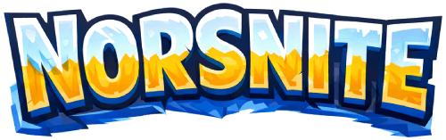

# NorsNite 🎮📖


 
Spill her: [Norsnite.Soteland.no](https://norsnite.soteland.no/) *(Åpent for alle!)*

Et Fortnite-inspirert norsk lesespill for barn 7–12 år. Målet er at barn skal **ha lyst til** å øve på lesing ved å pakke det inn i en engasjerende og visuelt spennende spillopplevelse.

*Hva gjør en pappa som kan kode, men som ikke er så flink lærer? Dette!*

> **Språk: Kun norsk.** Spillet er bygget for å lære norsk og jeg har ingen umiddelbare planer om å oversette det. All UI-tekst, instruksjoner, spørsmål og tilbakemeldinger er på norsk.

---

## Hva det er

- **Norsk lesetrening** — ikke fremmedspråklæring, men flyt og forståelse for morsmålsbrukere
- **Web app** som fungerer bra i Safari på iPad og iPhone
- **Innlogging** med e-post og passord — enkel kontooppretting med e-postverifisering
- **Venner-system** — søk opp venner, se deres liga-nivå, XP og merker på profilsiden deres
- **Solo spill-loop** — fullfør runder med minispill, tjen XP, klatre i ligaer, lås opp kosmetikk

---

## Minispill

| # | Navn | Beskrivelse | Låses opp på |
|---|------|-------------|--------------|
| 1 | **Ord→Bilde** | Les et ord, velg riktig emoji fra 3 valg | Bronse (start) |
| 2 | **Bilde→Ord** | Se en emoji, velg riktig ord fra 3 valg | Bronse (start) |
| 3 | **Fyll inn** | «Jeg vil ha en ___» → velg riktig ord fra 3 | Sølv |
| 4 | **Skriv ordet** | Hør/se et ord — skriv det selv (med ÆØÅ-knapper) | Gull |
| 5 | **Ordrekkefølge** | Bygg en setning fra stokket om ord-brikker | Platina |
| 6 | **Les og forstå** | Les et avsnitt → «Hva handlet dette om?» — velg 1 av 3 | Diamant |
| 7 | **Riming** | Velg hvilket ord som rimer med det gitte ordet | Sølv |
| 8 | **Synonym** | Velg ordet som betyr det samme | Gull |
| 9 | **Antonym** | Velg ordet som betyr det motsatte | Sølv |

Vanskelighetsgrad justeres automatisk: korte, enkle ord tidlig → lengre ord + komplekse setninger på høyere nivåer.

---

## XP- og Liga-system (Fortnite-stil)

```
Bronse → Sølv → Gull → Platina → Diamant → Elite → Champion → Ureal
```

- Hver riktig svar gir XP (justert etter vanskelighetsgrad og minispilltype)
- **Victory Royale**-skjerm ved rundegevinst
- **Kroneseier** — 10% sjanse ved rundestart til å spille med krone; du må få **alle svarene riktige** (perfekt runde) for å tjene +50% XP-bonus. Antall kroneseire vises på profil (👑 ×12)
- **Prestasjonsbadger** — låses opp ved milepæler (første riktige svar, streaker, kroneseire, og mer)
- Liga-badge vist på avatar og venneliste

---

## Kosmetikk og Avatar

- **Tilpassbar 2D-avatar** bygget med DiceBear — velg øyne, øyenbryn, munn, briller og bakgrunnsfarge
- **Tilfeldig avatar** genereres automatisk ved kontooppretting — juster den selv etterpå
- Hudtoner og morsomme farger (lilla, blå, grønn, oransje, rosa, cyan, gul, rød)
- **Loot box**-system med fire rariteter:
  - 🟫 **Vanlig** — +25 XP
  - 🟦 **Sjelden** — XP, hopp-token eller skjold
  - 🟪 **Episk** — større XP, token eller lengre skjold
  - 🟡 **Legendarisk** — stor XP, token eller flerdagers skjold

---

## Sikkerhet

- **Cloudflare Turnstile** CAPTCHA på kontooppretting — beskytter mot bot-registrering
- **E-postverifisering** — kontoen aktiveres ikke før e-posten er bekreftet
- **Slett konto** — krever at brukeren skriver inn brukernavnet sitt for å bekrefte. Slettes permanent via Supabase Edge Function med service-role nøkkel
- Row Level Security (RLS) på alle Supabase-tabeller

---

## Venner

- Søk opp venner på brukernavn
- Se vennens profil: avatar, liga, XP, statistikk og prestasjonsbadger
- Fjern venner med bekreftelsesdialog

---

## Teknologi-stack

| Lag | Valg |
|-----|------|
| Frontend | **React 18 + TypeScript** |
| Byggverktøy | **Vite** |
| Ruting | **TanStack Router** (type-sikker filbasert ruting) |
| Serverstatus | **TanStack Query** (hurtigbuffer + Supabase-integrasjon) |
| Klientstatus | **Zustand** (spilltilstand, aktiv runde, krone-status) |
| Skjemaer | **React Hook Form + Zod** |
| Styling | **Tailwind CSS + shadcn/ui** |
| Animasjoner | **Framer Motion** (Victory Royale, XP-bar, ligapromotering) |
| Avatar | **DiceBear** (Open Peeps-stil, SVG, ingen bildefiler) |
| Database + Auth | **Supabase** (Postgres, RLS, Edge Functions) |
| CAPTCHA | **Cloudflare Turnstile** |
| Hosting | **GitHub Pages** (gratis, kobler til GitHub Actions) |
| Keep-alive | **GitHub Actions** (ukentlig Supabase-ping) |

---

*Laget med kjærlighet — og AI — og litt for mye kaffe — for å gjøre norsklesing gøy.*
